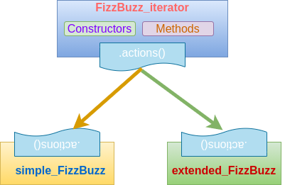

# FizzBuzz assignment

We want to write a Java program that prints the numbers from 1 to 100 to the "standard" output stream and follows these rules.

- For multiples of 3 it prints _Fizz_ instead of the number.
- For multiples of 5 it prints _Buzz_ instead of the number.
- For numbers which are multiples of both 3 and 5 it prints _FizzBuzz_.

### Extended Version

We want our Java program to print numbers from 1 to 105 and apply these additional rules.

- For multiples of 7 it prints _Bang_ instead of the number.
- For numbers which are multiples of both 3 and 7 it prints _FizzBang_.
- For numbers which are multiples of both 5 and 7 it prints _BuzzBang_.
- For numbers which are multiples of 3, 5 and 7 it prints _FizzBuzzBang_.

### Notes

- This assignment is a variant of the [Fizz Buzz Test](http://wiki.c2.com/?FizzBuzzTest).
- Feel free to change the existing code.

## Implementation

### *José Antonio Fernández Santisteban*

This implementation of the project has been made by separating the code into three classes:

One additional class `FizzBuzz` class, which is the main one, can be found on the project. This last class contains only the interaction between the user and the other classes. The abstract class `FizzBuzz_iterator` implements everything except the `FizzBuzz` and `FizzBuzzBang` conditions. This has been contemplated in the abstract method `actions()`, which is implemented by the extended classes `simple_FizzBuzz` and `extended_FizzBuzz`.

This program has been developed under Java 15.0.1.

### FizzBuzz_iterator class

This abstract class implements a sort of forward iterator that operates within a range limited by two positive integer values by performing steps of length 1. Under some conditions, a `String` can be returned instead of the number.

#### Private Members

The class is composed of 4 members:

* **int x**: It is the "counter". Is an integer number that counts the current iteration. Its value not necessarily corresponds to the number of iteration: it is simply a number into the provided range that marks the position within the range.
* **String mask**: This is the string value that masks `x` and, therefore, the value that is returned.
* **int ending**: Integer value containing the upper limit of the operation range (not included).
* **int beginning**: Integer value containing the lower limit of the operation range (included).

#### Public Methods

* **Condition()**: and **Condition_extended()**: If `x` follows the *FizzBuzz* and *Bang* conditions respectively, these methods updates `mask` consequently.
* **get()**: Returns the `mask` value.
* **reset()**: Set the status of the instance to the starting one.
* **next()**: Perform one step. If the iterator reach the last possible value, it return `false`, otherwise `true` is returned.

#### Constructors

* **FizzBuzz_iterator(int beginning, int ending)**: This is the main constructor. Constructs an iterator that operates in the range [`beginning`, `ending`). Note that the arguments must be integer positives.
* **FizzBuzz_iterator(int ending)**: Constructor with missing `ending`. It assumes `beginning`=0.

#### Abstract Methods

* **actions()**: This method should be implemented by extending the class. It should contain the conditions and procedure to replace the value of `mask`. 

### simple_FizzBuzz and extended_FizzBuzz classes

This classes which extends `FizzBuzz_iterator` implements its method `actions()` in order to represent the *FizzBuzz* and *FizzBuzzBang* behaviors respectively.

## Use

The compiled `.jar` file can be found at the directory `/build/libs`. The program, after compilation, can be run in its basic form with:

`~$ java -jar FizzBuzz-assignment-1.0.jar`

Some additional flags can be used:

* **-e**: Runs the extended version of the program i.e. *FizzBuzzBang*.
* **-f \<int\>**: Set the initial value of the iterator. By default it is 1.
* **-l \<int\>**: Set the final value of the iterator plus one. By default it is 101 in the case of basic  *FizzBuzz* mode and 106 in the case of *FizzBuzzBang* extended mode.

Note that in case of using many incompatible flags, the last ones will be the valid ones, for example, using:

`~$ java -jar FizzBuzz-assignment-1.0.jar -f 10 -r 20 -f 30 -r 40 -e`

has the same effect that:

`~$ java -jar FizzBuzz-assignment-1.0.jar -f 30 -r 40 -e`.

